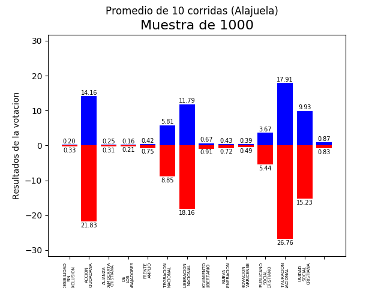

Inteligencia Artificial
======

Grupo #8
------
- Fabio Mora Cubillo - 2013012801
- Sergio Moya Valerin - 2013015682
- Gabriel Venegas Castro - 2013115967

Contenidos
------
- Instalación
- Proyecto Corto 1 - Simulador Votos (pc1)
- Proyecto 1 - Predicción Votaciones (p1)

Instalación
------

**Dependencias**

Tensorflow
```bash
python -m pip install tensorflow
```
sklearn
```bash
python -m pip install sklearn
```

**Opcion #1 (Preferible):**
```bash
python setup.py sdist
python -m pip install dist/tec-2.X.tar.gz
```
**Opcion #2:**
```bash
python setup.py install
```

Proyecto Corto 1 - Simulador Votos
======

Descripcion
------

Consiste de un generador de un dataset de tamano **n**. Este dataset generado sera utilizado por el predictor de votaciones para predecir los resultados completos de las rodas 1 y 2 del proceso electoral del 2018, Costa Rica.
Se implementaron dos funciones principales, una para generar una muestra para todo el pais y otro para generar una muestra por provincia, generar_muestra_pais y generar_muestra_provincia respectivamente.
Para ello se recolecto informacion del Tribunal Sumpremo de Elecciones respecto a los indicadores de canton y las actas respectivas.

Pruebas
------
En la carpeta test se encuentran archivos de prueba para los respectivos proyectos
Para el proyecto de simulacion de votos estan los siguientes archivos:
- **g08_pytest.py**: contiene las pruebas unitarias realizadas en *pytest*
- **g08_graficos.py**: contiene la generacion de graficos

  > Los graficos incluyen muestras de 1000, 10000 y 100000 para pais y tambien provincias.



Argumentos
------
**Simulador de votos**
  > --indicadores <archivo.csv>
--actas <archivo.csv>

   Ambos son obviables, puede especificarse uno, el otro, los dos o ninguno

Ejemplos
------
Para cargar las funciones principales del simulador se usa la siguiente linea:
```python
from tec.ic.ia.pc1.g08 import generar_muestra_pais, generar_muestra_provincia
```
La salida generada, en el caso de muestra de pais, tendra la siguiente forma, donde ... son 31 columnas numericas con las caracteristicas del votante como por ejemplo escolaridad.
|Provincia|...|Canton|Voto|
|--|--|--|--|
|Grecia|...|Alajuela|Unidad Social Cristiana|
|Vazquez de Coronado|...|San Jose|Voto blanco|
|Paraiso|...|Cartago|Liberacion Nacional|
|San Rafael|...|Heredia|Partido Accion Ciudadana|
Evidentemente el comportamiento es el mismo para generar muestra por provincia con la diferencia de que solo genera votantes en cantones de la provincia especificada.

Proyecto 1 - Predicción Votaciones
======